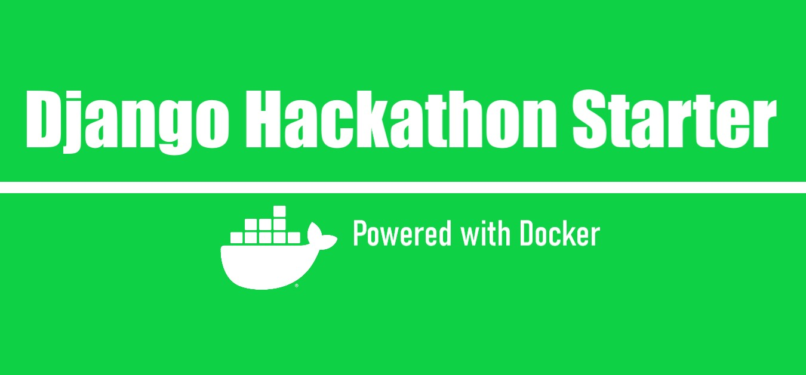

# Django Hackathon Starter (DHS)



## Introduction

Django Hackathon Starter packs the essentials required for a basic Django Web Application to run.
The provided code is well documented and will help any developer getting started with Django Web App development with ease.

DHS Packs the below **features** :
* User registration and authentication
* All working CRUD views
* Responsive interface with django messages
* Secured URLs with Login Required check
* _populate.py_ - Powered by Python Faker, used to populate random data in DB.

The application can be extended into anything, A Blog, A social media app, A e-commerce web app etc.

## Getting Started

Make sure you have Python 3 installed on your machine.
If not please install python first. [Click here for python official page.](https://www.python.org/downloads/)

1. Clone the repository on your machine.

```
git clone https://github.com/mohit4/django-hackathon-starter.git
```

2. Create virtual environment and install all requirements or just install the requirements directly.

```
pip install -r requirements.txt
```

or

```
virtualenv myproject
myproject\Scripts\activate
pip install -r requirements.txt
```

3. Run setup.py to rename your project

```
python setup.py < YOUR_PROJECT_NAME >
```

4. Create migrations and apply

```
python manage.py makemigrations
python manage.py migrate
```

5. Create a superuser, provide the details when prompt

```
python manage.py createsuperuser
```

6. Run population script, you can skip this step if you do not want dummy data to be populated

```
python populate.py < NO_OF_ENTRIES >
```

7. Now everything is done, start the application and type localhost:8000/ in your browser to see the application running

```
python manage.py runserver
```

Hurray, your project is running and you are way ahead of your competitors, start modifying the already provided templates and code files to customize your project. Best of luck from DHS Team.

## Technology Stack

1. Python 3.7
2. Django 2.2
3. Bootstrap 4

## Additional Links

**Python** - Python is an interpreted, high-level, general-purpose programming language. Created by Guido van Rossum and first released in 1991, Python's design philosophy emphasizes code readability with its notable use of significant whitespace. Its language constructs and object-oriented approach aim to help programmers write clear, logical code for small and large-scale projects. [Click here to for an interactive tutorial](https://www.codecademy.com/learn/learn-python)

**Django** - Django is a high-level Python Web framework that encourages rapid development and clean, pragmatic design. Built by experienced developers, it takes care of much of the hassle of Web development, so you can focus on writing your app without needing to reinvent the wheel. It’s free and open source. [Click here for official documentation](https://docs.djangoproject.com/en/2.2/)

**Bootstrap** - Build responsive, mobile-first projects on the web with the world’s most popular front-end component library. Bootstrap is an open source toolkit for developing with HTML, CSS, and JS. Quickly prototype your ideas or build your entire app with our Sass variables and mixins, responsive grid system, extensive prebuilt components, and powerful plugins built on jQuery. [Click here for official documentation](https://getbootstrap.com/docs/4.3/getting-started/introduction/)

Hit star:star: icon, comment:speech_balloon: and fork:fork_and_knife:
:smile: